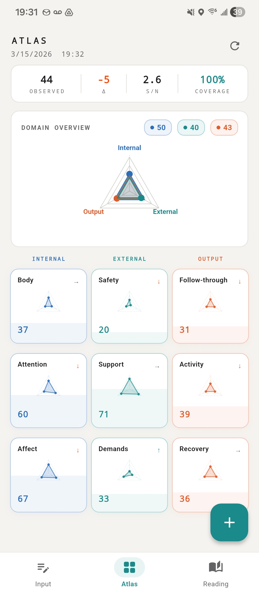
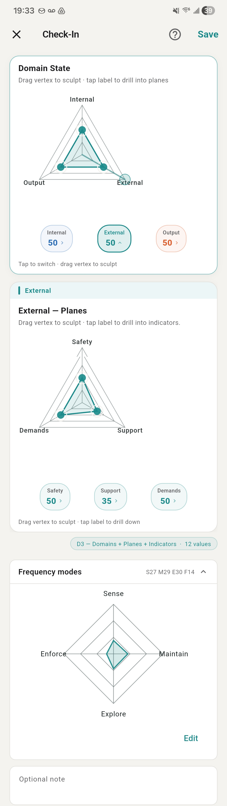
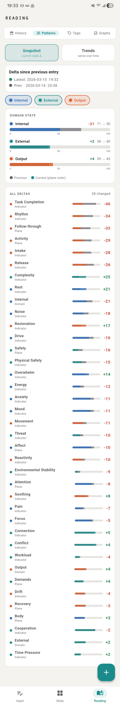
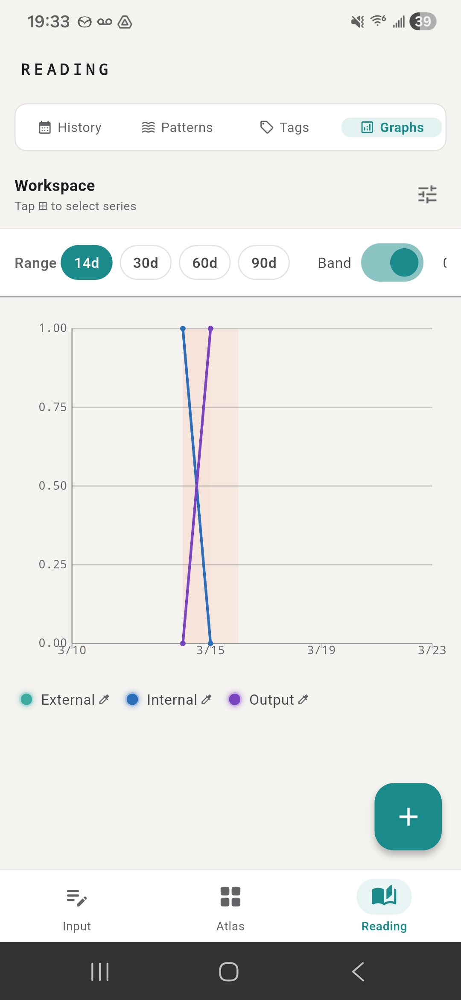

# Coheron - Observability tooling for human systems.
Track state. Preserve structure. Visualize behavior over time.

**Coheron** is a local-first personal observability system for modeling human state as a structured, multi-domain system.

It treats behavior, environment, and output not as isolated metrics, but as an interconnected system with measurable patterns, drift, and stability.
---

## Overview

Most self-tracking tools reduce complex human systems into flat metrics (steps, mood scores, time logs). This creates dimensional collapse—where important structure is lost.

Coheron approaches this differently:

- Models state across three domains  
- Preserves structure through hierarchical decomposition  
- Tracks change over time  
- Visualizes patterns as fields, not just numbers

---

## Why This Exists

Most tools track data. Coheron models systems.

When multi-dimensional state is reduced to single metrics, structure is lost and signals become misleading. Coheron preserves that structure and exposes behavior as a system over time.

---

## Screenshots

Coheron models state as a structured system and renders it across multiple views:

Atlas view: Aggregate system state across domains and planes.



---

Input View: Direct manipulation of domain, plane, and indicator values.



---

Readings View: Change tracking and relative movement between states.



---

Graph View: Temporal trends across domains and signals.



---

## Core Model

### Domains
- Internal — physiological and psychological state  
- External — environment and constraints  
- Output — behavior and actions  

### Planes → Indicators

INTERNAL  
Rest / Pain / Energy  
Focus / Overwhelm / Noise  
Anxiety / Mood / Drive  

EXTERNAL  
Safety / Noise / Barriers  
Support / Conflict / Demands  
Money / Time / Capacity  

OUTPUT  
Follow-through / Reactivity / Drift  
Activity / Intake / Rhythm  
Recovery / Soothing / Release  

---

## Key Features

- Structured input system (in progress)  
- Atlas visualization (Gaussian / density / contour)  
- Time-series tracking  
- Local-first architecture  

---

## Architecture

- Flutter frontend  
- Structured data model: Domain → Plane → Indicator  
- Processing pipeline: aggregation, delta computation, smoothing  
- Visualization layer: field-based rendering (Gaussian, density, contour)

---

## Positioning

Coheron is closer to observability tooling than traditional self-tracking.

---

## Current State

### Working
- Core taxonomy  
- Partial input + visualization  
- APK builds  

### Known Issues
- Input UI bugs  
- Persistence inconsistencies  
- Visualization overlap  

---

## Getting Started

```bash
flutter pub get
flutter run


